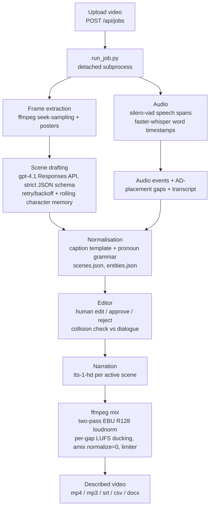

# Architecture

InstaScribe is a single-origin web app: one Flask process serves the React build,
the per-project data, the videos, and the JSON API. The heavy work runs in a
pipeline that the server launches per upload.

## Pipeline

Each stage writes plain JSON to the project directory, so the editor reads static
files and the API stays thin.

## Model providers

The three model-backed stages (vision drafting, Smart Fill rewrite, TTS) call a
small interface in `modular_pipeline/providers/`, never a vendor SDK. A factory
selects the backend at runtime from `INSTASCRIBE_BACKEND` (or the per-capability
`VISION_PROVIDER` / `TEXT_PROVIDER` / `TTS_PROVIDER`): `openai` (default), `local`
(Ollama for vision + text, Kokoro for TTS), or `fake` (deterministic, keyless —
used by the tests and the demo). Swapping a model is a config change. The mermaid
above shows the default OpenAI path; setup and the quality tradeoff of the local
models are in [local-models.md](./local-models.md).

## Single-origin serving

The Flask server (`modular_pipeline/server.py`) serves four things from one origin:
the compiled SPA from `App/dist`, per-project data under `/data`, source videos under
`/videos`, and the JSON API under `/api`. This keeps deployment to one container and
removes cross-origin configuration. The Dockerfile copies the pipeline, the built
frontend, and the bundled sample into a single `python:3.12-slim` image with ffmpeg.

## Overlays: study mode and demo mode

The normal app, the research study, and the public demo share one codebase through a
build-time flag rather than a fork.

- **Study mode** (`VITE_STUDY_MODE=1`) bypasses login, provisions an isolated per-
  participant copy of a frozen clip, logs interaction events, and replaces export with
  an eyes-closed preview. Used to run the 10-participant evaluation.
- **Demo mode** (`VITE_DEMO_MODE=1`) serves a fully pre-baked sample: every step that
  would call OpenAI or render with ffmpeg returns committed canned data instead. The
  build ships as a static SPA with no API key, so the public demo costs nothing to run
  and has nothing to break.

Both gate on a small flag check in the client and a few branch points, leaving the
production path untouched.

## Engineering notes

- **Concurrency correctness.** Per-job locks plus atomic temp-file writes guard the
  shared scene-override file against lost updates when edits arrive together; a
  semaphore caps simultaneous ffmpeg renders.
- **Loudness.** The mix targets broadcast loudness with two-pass EBU R128
  normalisation, ducks the background per gap by measured LUFS, and uses a single
  summing `amix` with `normalize=0` plus a limiter, so narration sits cleanly over the
  bed instead of being averaged down.
- **Character memory.** Identities established in one chunk of frames carry forward via
  a rolling memory, and a rename re-renders every dependent scene through a pronoun-
  aware caption template so the narration stays grammatical.
